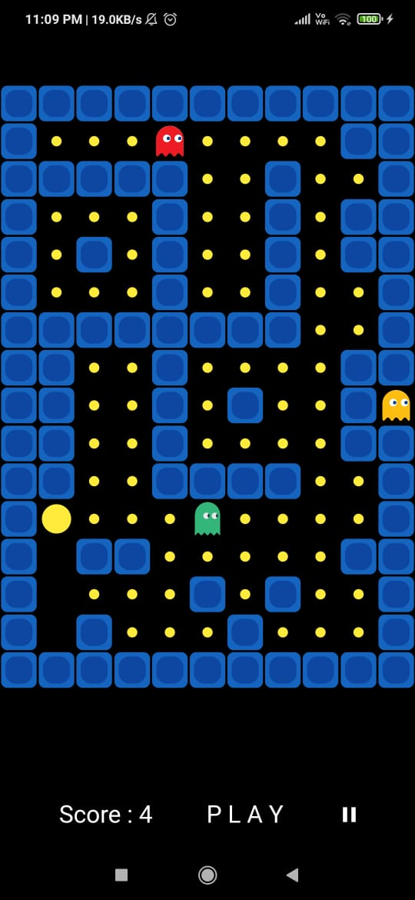
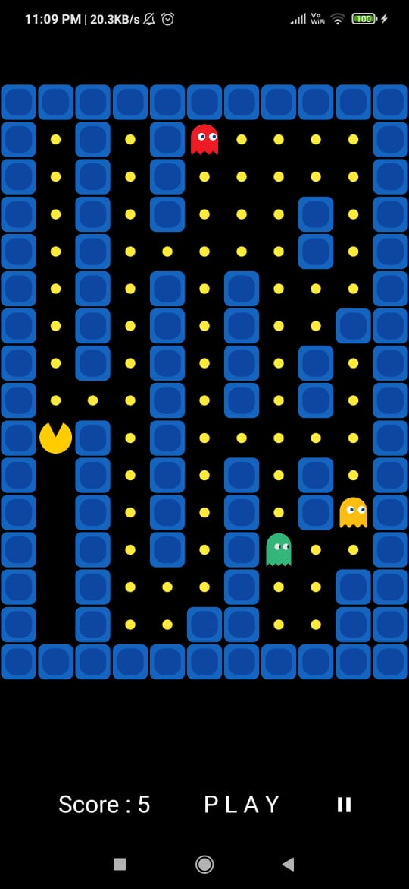

## App Preview 

## How to play Pacman
1. Download the apk.
2. Use gestures for moving
    - Swipe left to move left.
    - Swipe right to move right.
    - Swipe up to move up.
    - Swipe down to move down.
3. Stay away from ghosts.
4. Eat all the food.

## Different Types of Mazes in game
1. 
2. 
3. 

## Current Status of the app:
1. Offline single player/multiplayer working.
2. Map generation choses random map according to the difficulty from the list of maps.
3. Current feature allows various difficulty options according to number of ghosts, map difficulty and movement speed of ghost.

Future aspects:
1. Online intergration using socket or firebase.
2. Making size of map to be variable.
3. Special balls to increase life (in the game).
4. Random maze generation.
5. Allowing user to manually make a map.
6. Allowing users to click pictures and use their face instead of pacman.

Note:
1. The logic for socket initialisation is given in `sockets.dart` file.
2. The firebase integration is also done and the initialisation logic is present is `online_game_screen.dart` file.
    We managed to successfully setup the npm server and communicate to it at the basic text level.

## Online Sources 
1.https://github.com/schuay/pacman
2.https://github.com/DarkMuffinJoe/Pacman
3.https://en.wikipedia.org/wiki/User:Dllu/Maze
4.https://lazyfoo.net/tutorials/SDL/
