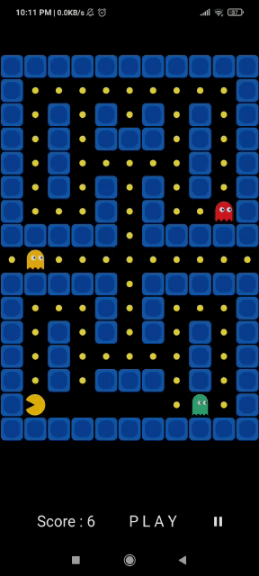
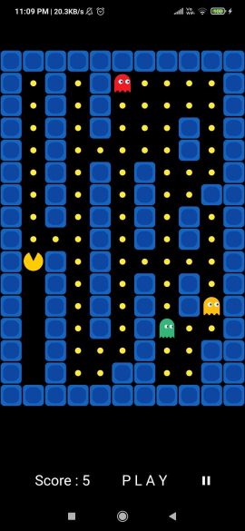
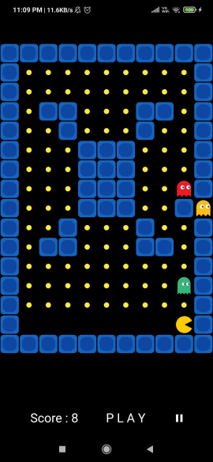
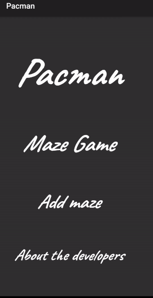

## App Preview 



## How to play Pacman
1. Download the apk.
2. Use gestures for moving
    - Swipe left to move left.
    - Swipe right to move right.
    - Swipe up to move up.
    - Swipe down to move down.
3. Stay away from ghosts.
4. Eat all the food.


## Different Types of Mazes in game
1. 
2. 
3. 

## GIFs describing the features

- There is also an option to make a custom maze
<br> <br> <br>

- An option to add custom image in place of pacman is also given
<br> <br> <br>


## Directory Layout

```go
 Pacman
   +--- README, LICENSE // basic information
   +--- assets  // contains all assets like images for project
   |
   +--- lib
        +--- images // Containes images of various characters
            +--- cyan.png
            +--- finish.png
            +--- pacman.png
            +--- player.png
            +--- red.png
            +--- yellow.png
        +--- add_maze.dart // Opens the screen of custom maze generation.
        +--- camera.dart // Opens the file containing camera.
        +--- developers.dart // Opens the pags of about the developers
        +--- form.dart // Opens the form that is required before the game
        +--- gamescreen.dart // Opens the pacman game
        +--- generated_plugin_registrant.dart // Auto-generated file
        +--- homepage.dart // Contains the homepage
        +--- main.dart 
        +--- maze_objects.dart // Contains the classes required for maze
        +--- mazegame.dart // Opens the maze game
        +--- movables.dart // Contains the classes of movables
        +--- online_game_screen.dart // The firebase screen
        +--- playerlist.dart // Contains information about players when playing multiplayer game
        +--- preview.dart // Opens the file that previews the image
        +--- sockets.dart // The socket screen
        +--- status.txt // The status of app
        
   +--- firebase files 
   +--- pubspec.yaml
   +--- miscellaneous
   +--- etc
```

## What's working:


- [x] Offline single player/multiplayer working.
- [x] Map generation choses random map according to the difficulty from the list of maps.
- [x] Current feature allows various difficulty options according to number of ghosts, map difficulty and movement speed of ghost.
- [x] We have added the various sound effects of the pacman game.
- [x] Allowing the user to create his own map.
- [x] Allowing users to click pictures and use their face instead of pacman.

Future aspects:
 - Online intergration using socket or firebase.
 - Multiple storage of images.
 - Special balls to increase life (in the game).

Note:
1. The logic for socket initialisation is given in `sockets.dart` file.
2. The firebase integration is also done and the initialisation logic is present is `online_game_screen.dart` file.
    We managed to successfully setup the npm server and communicate to it at the basic text level.

## Online Sources 
1.https://github.com/schuay/pacman
2.https://github.com/DarkMuffinJoe/Pacman
3.https://en.wikipedia.org/wiki/User:Dllu/Maze
4.https://lazyfoo.net/tutorials/SDL/
